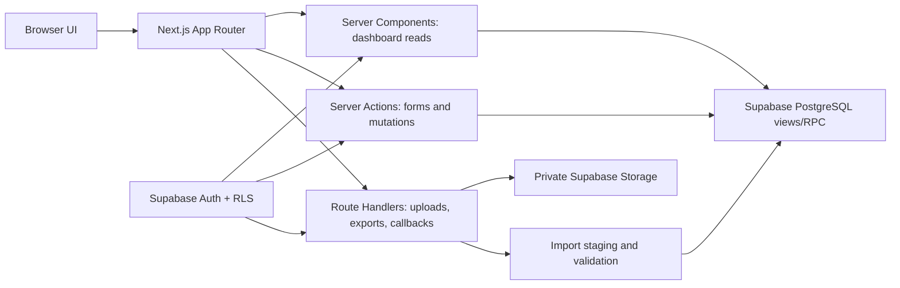

# HR Workforce Intelligence — Product and Implementation Plan

**Status:** implementation-ready product specification  
**Source workbook:** `Dummy_Employee_Master_Data_100_Rows (1).xlsx`  
**Reference UI:** <https://hr-workforce-intelligence.sugary-zebra-6173.chatgpt.site/>  
**Recommended stack:** Next.js App Router + TypeScript + Supabase PostgreSQL/Auth/Storage + shadcn/ui + Recharts

## 1. Product objective

Build an authenticated HR workforce intelligence application that turns the employee master into a decision-making product, not a collection of unrelated charts. The product narrative is:

> Who is in the workforce → where they are positioned → how experienced they are → where retirement or data risk exists → what HR should inspect or maintain.

The product will support three connected workflows:

1. **Analyze:** executive and HR dashboards with governed KPIs, filters, comparisons, and drill-through.
2. **Inspect and maintain:** find, add, and edit an employee or a governed custom field.
3. **Import and govern:** upload Excel/CSV data, map fields, validate records, preview changes, commit safely, and retain an audit trail.

### Success criteria

- An executive understands workforce condition and the main exceptions in under 30 seconds.
- Every KPI and chart has an explicit business question, source-field lineage, and calculation definition.
- Direct facts are clearly separated from derived or combined insights.
- Unsupported conclusions are not presented as facts.
- Sensitive employee data is visible only to authorized users.
- Imports cannot silently corrupt the employee master.
- The visual language is a close, reusable implementation of the supplied reference site across desktop and mobile.

## 2. Source workbook understanding

The workbook contains two sheets with different purposes.

| Sheet | Size | Role in the application |
|---|---:|---|
| `Sheet` | 100 employee rows × 27 columns | Employee master and analytical source |
| `Sheet2` | 45 rows × 9 columns | Field terminology, provisional meanings, dataset observations, and dashboard-use guidance |

`Sheet2` is useful as the starting content for the Field Guide, but descriptions marked uncertain must remain provisional until HR confirms them.

### 2.1 Source columns and treatment

| Source column | Proposed database key | Treatment | Primary use |
|---|---|---|---|
| `Pers.No.` | `personnel_number_alias` | Validation/detail | Reconcile with `Personnel Number`; do not double-count |
| `Personnel Number` | `personnel_number` | Trusted primary business key | Distinct employee-record count and upsert key |
| `Employee Group` | `employee_group` | Trusted dimension | Direct/Indirect mix |
| `LP` | `lp_code` | Conditional code | Distribution only until meaning is confirmed |
| `ESgrp` | `employee_subgroup_code` | Conditional code | Distribution/detail; do not invent labels |
| `Employee Subgroup` | `employee_subgroup` | Valid but constant in this file | Detail/quality, not a useful current chart |
| `PS group` | `ps_group` | Conditional code | Grade/pay-scale mix only if HR confirms semantics |
| `Organizational Unit` | `organizational_unit` | Detail/high-cardinality dimension | Search, fragmentation, and drill-through |
| `Range` | `range_code` | Conditional and constant-like | Detail only until defined |
| `Function` | `function_name` | Trusted dimension | Core workforce and retirement analysis |
| `Organisational Area(PA)` | `organizational_area_code` | Conditional code | Organization-code distribution |
| `Gender Key` | `gender_code` | Trusted sensitive dimension | Aggregated representation analysis |
| `Location` | `location_name` | Trusted dimension | Workforce positioning |
| `PA` | `pa_code` | Unconfirmed, almost unique | Detail/quality only |
| `Personnel Area` | `personnel_area` | Valid but constant | Detail/quality, not a useful current chart |
| `PSubarea` | `personnel_subarea_code` | Conditional code | Subarea distribution |
| `Personnel Subarea` | `personnel_subarea` | Valid but constant | Detail/quality, not a useful current chart |
| `NT_ID` | `nt_id` | Sensitive identifier | Authorized search and uniqueness checks |
| `Global ID` | `global_id` | Sensitive identifier | Authorized search and uniqueness checks |
| `Cost Ctr` | `cost_center_code` | Detail/high-cardinality code | Search and data quality; no cost claim |
| `Birth date` | `birth_date` | Sensitive lifecycle date | Derive age and age band; hide exact date in broad views |
| `Date of Joinin` | `date_of_joining` | Trusted lifecycle date; normalize header typo | Tenure, joining cohort, anniversaries |
| `Entry for Retirement` | `retirement_date` | Trusted with consistency checks | Retirement horizon and pipeline |
| `Designation Text` | `designation_text` | Trusted dimension | Role mix and drill-through |
| `Global-Id of HRBP` | `primary_hrbp_global_id` | Conditional assignment | Primary HRBP coverage/workload |
| `Global-Id Of HRBP2` | `secondary_hrbp_global_id` | Conditional assignment | Secondary/backup coverage after definition is confirmed |
| `Email Official` | `official_email` | Sensitive identifier | Authorized search and validation; never chart |

### 2.2 Guardrails on interpretation

- The source has no active/inactive field. Until one is added, label the primary count **Employee records**, not guaranteed active headcount.
- No salary or spend is present; `Cost Ctr` cannot support payroll or cost analysis.
- No manager-to-employee relationship is present; span of control and organizational hierarchy cannot be calculated.
- No latitude/longitude or canonical site table is present; use location bars/heatmaps, not a geographic map.
- No skills, performance, vacancy, attrition, or succession data is present; do not claim critical-skill loss or replacement readiness.
- HRBP identifiers show assignment coverage, not HRBP performance.
- Retirement exposure is descriptive and date-dependent; it is not an attrition prediction.
- Age and tenure metrics require a visible **as-of date** and must not silently use a different date per page.

## 3. Information architecture

| Route | Page | Business question | Primary audience |
|---|---|---|---|
| `/` | Executive Overview | What is the overall condition and structure of the workforce? | Executives, CHRO, HR leaders |
| `/workforce` | Workforce Composition | Who makes up the workforce, and how is it distributed across functions, roles, groups, and gender? | HR leaders, HR analysts |
| `/organization` | Organization & Location | Where is the workforce positioned, how do organization codes relate, and how fragmented are HR support assignments? | HR operations, HRBPs |
| `/lifecycle` | Lifecycle & Retirement | How experienced is the workforce, and where could future retirement exposure develop? | Workforce planning, HR leaders |
| `/quality` | Data Quality | Can HR trust the employee master and the metrics derived from it? | HR operations, data stewards |
| `/employees` | Employee Explorer | How can an authorized HR user find and inspect or maintain an employee record? | Authorized HR users |
| `/data-hub` | Data Hub | How is data imported, validated, reconciled, and maintained? | HR admins, data stewards |
| `/field-guide` | Field Guide & Manager | What does each field mean, and how can standard and custom fields be governed safely? | Analysts, admins, data stewards |

### Global controls

The sticky filter bar is shared by analytical pages:

- As-of date
- Function
- Location
- Employee Group
- Gender
- Designation
- LP / PS Group / organizational-code filters under an **Advanced** popover
- Reset filters
- Applied-filter chips and result count

Filters are stored in URL search parameters so views are linkable, refresh-safe, and testable. Employee Explorer may add identifier and free-text search; Data Hub and Field Guide use task-specific filters instead.

## 4. Page specifications

### 4.1 Executive Overview

**Decision intent:** give a compact, balanced view of workforce scale, composition, experience, geographic concentration, and immediate exceptions.

#### KPIs

| KPI | Definition | Mapping type | Columns |
|---|---|---|---|
| Employee records | `COUNT(DISTINCT personnel_number)` | Direct aggregate | `Personnel Number` |
| Functions | Distinct nonblank functions | Direct aggregate | `Function` |
| Locations | Distinct nonblank locations | Direct aggregate | `Location` |
| Average age | Average completed years between birth date and as-of date | Derived | `Birth date` + as-of date |
| Average tenure | Average completed years between joining date and as-of date | Derived | `Date of Joinin` + as-of date |
| Retirement exposure — 5 years | Employees with retirement date from as-of date through +5 years | Derived | `Entry for Retirement` + as-of date |

#### Main visuals

| Visual | Type | Question answered | Mapping |
|---|---|---|---|
| Workforce by function | Sorted horizontal bar | Which functions contain the largest workforce? | `Function` + distinct `Personnel Number` |
| Workforce by location | Donut or sorted bar | Where are employee records concentrated? | `Location` + distinct `Personnel Number` |
| Direct/Indirect mix | Donut | What is the workforce-group mix? | `Employee Group` + distinct `Personnel Number` |
| Age × tenure profile | Compact quadrant/scatter or banded heatmap | Is experience concentrated in particular age/tenure combinations? | `Birth date` + `Date of Joinin` + as-of date |
| Executive insight card | Ranked narrative callouts | What should leadership notice first? | Largest share, highest concentration, retirement exposure, and quality exceptions |

#### Combined insights

- **Function share** = function records ÷ all filtered employee records.
- **Location concentration** = largest location records ÷ filtered employee records.
- **Experienced workforce share** = tenure ≥ 10 years ÷ filtered employee records.
- **Retirement-exposed function** = count and rate retiring in chosen horizon by `Function`; show both because the largest count may not have the largest rate.
- **Trust qualifier** = display data-quality issue count beside metrics if rules affect records in the current filter context.

#### Expected insight pattern from the supplied file

Sales is the largest function (31 records), Jaipur is the largest location (26), the workforce is 56% Indirect, average age is about 34.2 years, and average tenure is about 9.4 years as of 2026-08-08. These are verification baselines, not hardcoded UI values.

### 4.2 Workforce Composition

**Decision intent:** explain who makes up the workforce and reveal imbalances that disappear in single-dimension totals.

#### KPIs

- Largest function and its workforce share
- Largest designation and its share
- Gender representation split
- Direct/Indirect split
- Number of distinct designations
- Number of coded employee/grade groups in the current filter context

#### Main visuals and mappings

| Visual | Type | Insight | Direct columns | Combined mapping |
|---|---|---|---|---|
| Function distribution | Ranked horizontal bar | Relative functional scale | `Function`, `Personnel Number` | Count and % of filtered total |
| Gender by function | 100% stacked horizontal bar | Representation differs by function | `Gender Key`, `Function`, `Personnel Number` | Gender share within each function |
| Employee Group by function | Grouped/stacked bar | Core/support mix varies by function | `Employee Group`, `Function`, `Personnel Number` | Direct/Indirect count and rate per function |
| Designation mix | Ranked bar | Which roles dominate the master? | `Designation Text`, `Personnel Number` | Designation share; optional designation × function drill-down |
| Function × location | Heatmap | Where functional teams are concentrated | `Function`, `Location`, `Personnel Number` | Cell count plus row/column percentage toggle |
| Code-distribution panel | Compact ranked lists | How LP, ESgrp, PS group, and Range are distributed | `LP`, `ESgrp`, `PS group`, `Range` | Counts only; display original codes and definition status |

#### New insights from combined fields

- **Gender balance by function/location/designation:** combine `Gender Key` with each business dimension; never infer gender beyond supplied codes.
- **Direct/Indirect functional profile:** `Employee Group` × `Function` reveals whether a function leans toward the supplied Direct or Indirect classification.
- **Role concentration:** `Designation Text` × `Function` shows whether one title dominates a function.
- **Workforce concentration index:** sum of squared location shares within a function; use as a comparative fragmentation measure, clearly labelled as a derived index.
- **Cross-filter narrative:** after filters, regenerate the top three notable differences rather than showing a static paragraph.

#### Verified examples

- Sales contains 20 Indirect and 11 Direct employee records.
- HR contains 14 Direct and 9 Indirect records.
- Jaipur is strongly female-coded in this dataset (22 F, 4 M), while Chennai is 5 F and 10 M. This is a descriptive observation, not an equality assessment.

### 4.3 Organization & Location

**Decision intent:** show where employees are positioned, expose organization-code fragmentation, and assess HRBP assignment coverage without pretending the codes form a confirmed hierarchy.

#### KPIs

- Locations
- Organizational units
- Organizational area codes
- Personnel subarea codes
- Primary HRBP IDs and average employees per primary HRBP
- Secondary HRBP IDs and average employees per secondary HRBP
- Unique primary-secondary HRBP pairs
- Records missing either HRBP assignment

#### Main visuals and mappings

| Visual | Type | Insight | Columns and combination |
|---|---|---|---|
| Location distribution | Ranked bar | Workforce size by city/site | `Location` + distinct `Personnel Number` |
| Function × location | Heatmap | Functional concentration by site | `Function` + `Location` + `Personnel Number` |
| Organization-code coverage | Ranked list/small multiples | Which codes are common or nearly unique? | `Organisational Area(PA)`, `PSubarea`, `LP`, `PS group`, `ESgrp`, `Range` |
| Location-to-code relationship | Sankey only after semantics are approved; otherwise matrix | How location relates to organization codes | `Location` + chosen confirmed code + count |
| HRBP workload | Sorted bar with median reference | How many records each primary HRBP supports | `Global-Id of HRBP` + `Personnel Number` |
| HRBP support breadth | Dot plot/table | How many functions and locations each HRBP supports | HRBP ID + `Function` + `Location` |
| HRBP-pair fragmentation | Ranked table | Are primary-secondary pairs reused or almost unique? | Both HRBP fields + distinct employee count |

#### New insights from combined fields

- **Site specialization** = each function’s share within a location using `Function` + `Location`.
- **HRBP breadth** = distinct functions and locations per HRBP.
- **HRBP workload dispersion** = min/median/max and coefficient of variation of employee-record counts by HRBP.
- **Pair fragmentation** = unique primary-secondary pairs ÷ records with both IDs.
- **Code fragmentation** = distinct codes ÷ employee records for `Organizational Unit`, `PA`, and `Cost Ctr`; high ratios warn that a field is poor for executive aggregation.
- **Code relationship completeness** = percentage of records with every selected organization-code field populated.

#### Verified examples

The file has 96 organizational units, 99 `PA` codes, 100 cost centers, and 99 unique primary-secondary HRBP pairs across 100 records. This indicates extreme fragmentation; the page should surface it as a governance observation, not render an artificial hierarchy.

### 4.4 Lifecycle & Retirement

**Decision intent:** describe workforce experience and highlight where retirement exposure may develop over explicit time horizons.

#### KPIs

- Average age
- Average tenure
- Average age at joining
- Average expected retirement age
- Retirement exposure within 1, 3, 5, 10, and 15 years
- Employees reaching 5-, 10-, 15-, or 20-year anniversaries in the selected year
- Records with lifecycle-date anomalies

#### Main visuals and mappings

| Visual | Type | Insight | Mapping |
|---|---|---|---|
| Age bands | Ordered histogram/bar | Age profile | `Birth date` + as-of date → age/age band |
| Tenure bands | Ordered bar | Experience profile | `Date of Joinin` + as-of date → tenure/tenure band |
| Retirement pipeline | Ordered horizon bar | When exposure emerges | `Entry for Retirement` + as-of date → horizon band |
| Retirement by function | Bar with Count/Rate toggle | Which functions have greatest exposure? | `Function` + retirement horizon + `Personnel Number` |
| Retirement by location | Bar with Count/Rate toggle | Which sites have greatest exposure? | `Location` + retirement horizon + `Personnel Number` |
| Retirement by designation | Ranked bar/table | Which roles may be affected? | `Designation Text` + retirement horizon |
| Joining cohort | Column chart | When current employee records joined | `Date of Joinin` → year/cohort |
| Anniversary calendar | Timeline/table | Who reaches a service milestone? | `Date of Joinin` + selected year; employee detail is permission-controlled |

#### Derived definitions

- `age_years = completed_years(birth_date, as_of_date)`
- `tenure_years = completed_years(date_of_joining, as_of_date)`
- `joining_age_years = completed_years(birth_date, date_of_joining)`
- `expected_retirement_age = completed_years(birth_date, retirement_date)`
- `years_to_retirement = fractional_years(as_of_date, retirement_date)`
- `retirement_horizon = 0–1, 2–3, 4–5, 6–10, 11–15, 16–20, >20, past/invalid`
- `service_milestone = selected_year - year(date_of_joining)` with exact anniversary-date handling
- `retirement_rate_by_group = exposed records in group ÷ all records in group`

#### New insights from combined fields

- **Retirement exposure count vs rate:** combine retirement date with function/location/designation, showing both absolute impact and proportional exposure.
- **Experience at risk:** sum or average tenure of retirement-exposed employees by function.
- **Age-tenure matrix:** combine birth and joining dates to distinguish older recent joiners from long-service employees.
- **Anniversary demand:** joining date + current year supports recognition planning.
- **Date plausibility:** birth date + joining date flags implausible joining ages; birth date + retirement date checks retirement-policy consistency.

#### Verified examples

As of 2026-08-08, this file has no retirement dates within five years, 3 within ten years, and 18 within fifteen years. Finance has 4 of 14 records within fifteen years (about 29%), while Sales has the largest exposed count at 7. Twenty-four records have a derived joining age below 18 and require review.

### 4.5 Data Quality

**Decision intent:** make trust measurable, traceable, and actionable.

#### Quality dimensions and KPIs

| Dimension | Example KPI | Rules |
|---|---|---|
| Completeness | Required-field completion rate | Null/blank checks for governed required fields |
| Uniqueness | Unique identifier rate | Duplicate `Personnel Number`, `Global ID`, `NT_ID`, and email |
| Consistency | Cross-field consistency rate | `Pers.No.` equals `Personnel Number`; retirement-age consistency |
| Validity | Valid record rate | Date order, joining-age threshold, email form/domain policy, allowed category values |
| Usability | Analytical usability rate | Constant fields, near-unique dimensions, unconfirmed code meanings |
| Overall score | Weighted quality score | Configurable weights; never hide underlying issue counts |

Recommended initial score weights: Completeness 25%, Uniqueness 25%, Validity 25%, Consistency 15%, Usability 10%. Store weights in governed configuration, not frontend constants.

#### Main visuals

| Visual | Type | Insight | Mapping |
|---|---|---|---|
| Overall quality score | Conic/radial score with component breakdown | Can the dataset support trusted analysis? | All active validation rules |
| Quality dimension cards | KPI/progress cards | Which trust dimension is weakest? | Rule outcomes by dimension |
| Issues by rule and severity | Ranked horizontal bar | What needs correction first? | `validation_issues` grouped by rule/severity |
| Field quality matrix | Heatmap/table | Which fields fail which dimensions? | Field × issue type |
| Affected records | Filterable table | Which records need action? | Employee key + issue code + source value + explanation |
| Import-quality trend | Line chart after multiple imports | Is source quality improving? | Import batch + score/issue count |

#### Combined checks

- `Pers.No.` ↔ `Personnel Number` equality.
- `Birth date` < `Date of Joinin` < `Entry for Retirement`.
- Derived joining age must meet an HR-configured minimum; default review threshold 18, not an automatic deletion rule.
- Derived retirement age compared with the configured policy range.
- Identifier/email uniqueness across records.
- HRBP assignment completeness using both HRBP fields.
- Categorical values compared with approved value lists.
- High cardinality warning when distinct count ÷ record count exceeds a configurable threshold.
- Constant-field warning when distinct nonblank values = 1.
- Unconfirmed-field warning from the Field Guide governance status.

#### Verified examples

The supplied file has no blanks in the 27 source columns, no duplicate employee IDs/emails, and complete equality between the two personnel-number fields. However, 24 records have a derived joining age below 18 and 7 have retirement-date policy inconsistencies, with one overlapping record; 30 unique records are therefore flagged by these two checks. All official emails use the dummy `example.com` domain and must remain recognized as test data.

### 4.6 Employee Explorer

**Decision intent:** provide fast, authorized record discovery, inspection, and controlled maintenance.

#### Core interactions

- Search by Personnel Number, Pers.No., NT ID, Global ID, official email, designation, function, location, organizational unit, or cost center.
- Filterable, sortable, paginated table with column chooser and saved views.
- Click a record to open a right-side profile drawer on desktop or full-screen sheet on mobile.
- Profile sections: Identity, Workforce Classification, Organization & Location, Lifecycle, HRBP Assignments, Contact, Custom Fields, Data Quality, Change History.
- Add employee, edit employee, deactivate/archive when an employment-status field is introduced, and export the authorized record.
- Show field-level validation before save and a human-readable change summary before commit.

#### KPI/visual treatment

This is an operational page, so a large chart is not the main element. Use:

- Result count
- Records with quality issues
- Records updated in the selected period
- Search/table plus profile drawer
- Small lifecycle timeline only inside the profile

#### Mapping

All 27 source fields are available according to role and field-sensitivity policy. Derived profile values include age, tenure, joining age, expected retirement age, years to retirement, and issue flags. Exact birth date, email, and identifiers are not shown on broad dashboard cards.

#### Add/edit rules

- `Personnel Number` is required and unique.
- `Pers.No.` defaults to Personnel Number unless HR confirms a separate purpose.
- Validate unique Global ID, NT ID, and email.
- Normalize dates and category codes before save.
- Prefer a confirmed server response for sensitive employee edits; if optimistic UI is used for a low-risk interaction, roll it back on validation failure or version conflict.
- Every create/update records actor, timestamp, old values, new values, and reason.

### 4.7 Data Hub

**Decision intent:** make imports safe, explainable, repeatable, and reversible.

#### Supported ingestion

| Format | Version | Treatment |
|---|---|---|
| `.xlsx` | V1 | Structured employee import with sheet selection and header mapping |
| `.csv` | V1 | Structured employee import with delimiter/encoding detection |
| `.xls` | V1.1 | Convert or parse after security and compatibility testing |
| `.docx` / `.pdf` | V1 | Store as governed reference documents only |
| `.docx` / `.pdf` structured extraction | Later phase | Extract to staging with mandatory human mapping/review; never write directly to employee master |

#### Import workflow

1. **Upload** to a private Supabase Storage bucket.
2. **Select source sheet** and header row for Excel.
3. **Profile** row count, columns, inferred types, blanks, and duplicate headers.
4. **Map** incoming headers to standard or approved custom fields; save reusable templates.
5. **Validate** required fields, identifiers, dates, categories, and cross-field rules.
6. **Preview** inserts, updates, unchanged rows, warnings, and rejected rows.
7. **Confirm** with an explicit import summary and optional change reason.
8. **Commit atomically** using Personnel Number as the default upsert key.
9. **Audit and reconcile** committed counts with the preview.
10. **Download error file** and, where feasible, roll back the complete batch.

#### Page components and KPIs

- Drag-and-drop upload zone and browse button
- Recent import batches table
- Import-template selector
- Mapping grid with confidence and required-field markers
- Validation summary: rows read, valid, warning, rejected, new, changed, unchanged
- Issue table with row number, field, source value, rule, severity, and suggested correction
- Batch details drawer with actor, source hash, timestamps, mapping version, and commit result
- Download template, export current dataset, retry failed batch, and rollback authorized batch

#### Combined mapping insights

- **Duplicate candidate:** incoming Personnel Number/Global ID/NT ID/email matched against current employee records.
- **Change detection:** normalized incoming record compared field-by-field with stored record.
- **Import risk:** severity-weighted issues ÷ rows read.
- **Mapping coverage:** required mapped fields ÷ all required fields.
- **Reconciliation:** inserted + updated + unchanged + rejected must equal parsed rows.

### 4.8 Field Guide & Manager

**Decision intent:** make every field understandable, governed, and reusable across imports, forms, filters, and metrics.

#### Field Guide experience

- Search by source name, database key, label, description, or category.
- Group fields into Identity, Workforce Classification, Organization, Location, Lifecycle, HRBP, Contact, and Custom.
- Show source header, friendly label, definition, data type, sample values, sensitivity, required status, uniqueness, analytical treatment, allowed values, owner, and governance status.
- Show **Direct**, **Derived**, **Detail only**, **Conditional**, or **Excluded from analytics** badges.
- Show formula recipes for age, tenure, retirement horizon, milestones, and quality rules.
- Show a lineage relationship: Source field → normalized database field → derived view/metric → pages/visuals.

#### Field Manager experience

- Admin/data-steward-only create and edit for field definitions.
- Add custom fields with label, stable key, type, required flag, validation, allowed values, default, sensitivity, visibility roles, and import aliases.
- Deprecate fields rather than deleting fields with data.
- Core analytical fields require a database migration and review.
- Optional custom fields use `field_definitions` plus typed `employee_field_values`; do not continually add arbitrary nullable columns to `employees`.
- Preview how a field appears in the employee form and import mapper.
- Audit every definition and validation change.

#### Main visuals

- Field-treatment summary cards
- Two-column field cards on desktop, one column on mobile
- Dark relationship-flow card
- Metric recipe grid
- Usage table showing which pages and KPIs consume each field

## 5. KPI and derived-field contract

All calculations belong in a governed analytics layer, not duplicated inside individual chart components.

| Derived field/measure | Definition | Input columns |
|---|---|---|
| `employee_record_count` | Distinct `personnel_number` | `Personnel Number` |
| `age_years` | Completed years from birth date to as-of date | `Birth date` |
| `age_band` | `<25`, `25–34`, `35–44`, `45–54`, `55–64`, `65+`, Unknown | `age_years` |
| `tenure_years` | Completed years from joining date to as-of date | `Date of Joinin` |
| `tenure_band` | `<2`, `2–5`, `6–10`, `11–20`, `21+`, Unknown | `tenure_years` |
| `joining_age_years` | Completed years from birth date to joining date | Birth + joining date |
| `expected_retirement_age` | Completed years from birth date to retirement date | Birth + retirement date |
| `years_to_retirement` | Difference between retirement and as-of dates | Retirement date |
| `retirement_horizon` | Ordered bucket based on years to retirement | Retirement date |
| `service_milestone` | Exact years of service reached in selected year | Joining date |
| `dimension_share` | Group count ÷ filtered total | Personnel Number + selected dimension |
| `retirement_exposure_rate` | Exposed group count ÷ all group records | Retirement date + group |
| `hrbp_workload` | Distinct employees per HRBP ID | HRBP + Personnel Number |
| `hrbp_breadth` | Distinct functions and locations per HRBP | HRBP + Function + Location |
| `fragmentation_ratio` | Distinct codes ÷ filtered employee records | Selected code + Personnel Number |
| `data_quality_score` | Weighted quality-dimension pass rates | Validation outcomes + configured weights |

Use PostgreSQL functions or views with one shared `as_of_date` input strategy. UI labels must show the selected date. Tests must cover birthday/anniversary boundaries, leap years, future dates, nulls, and exact horizon cutoffs.

## 6. Design principles extracted from the reference site

The following is a measured design specification from the supplied site. It recreates the visual language and interaction pattern without depending on its hosted code or hardcoded demo data.

### 6.1 Visual character

- Warm, editorial dashboard rather than a generic blue SaaS admin panel.
- Deep ink/navy provides structure; coral is the main action and attention color.
- Cream backgrounds and off-white cards reduce glare.
- Rounded cards, subtle borders, and soft shadows create depth without glassmorphism.
- Large Manrope headings and compact DM Sans interface text create a clear hierarchy.
- Charts use a restrained five-color palette consistently across pages.
- Insights are written as short business observations inside a dark feature card.

### 6.2 Exact observed color tokens

```css
:root {
  --canvas: #F4F1E9;
  --surface: #FFFDF8;
  --surface-filter: #F9F6EF;
  --ink: #172028;
  --sidebar: #182932;
  --navy-card: #203849;
  --navy-metric: #284B63;
  --coral: #F06449;
  --muted: #6F756F;
  --border: #DEDBD3;
  --gridline: #E5E3DD;
  --sage: #78A083;
  --sage-text: #55775F;
  --gold: #EDB458;
  --gold-text: #A66B13;
  --purple: #7D6B91;
  --success-bg: #EDF6EF;
  --success-border: #C6DFCC;
  --success-text: #4C7E58;
  --warning-bg: #FFF8E8;
  --warning-border: #EAD8B0;
  --warning-text: #9A6C23;
  --detail-bg: #EDF3F6;
  --detail-border: #CCD9DF;
  --detail-text: #3E687B;
  --exclude-bg: #FFF2EE;
  --exclude-border: #E7C9C0;
  --exclude-text: #B24A35;
  --danger-bg: #FFE5DF;
  --danger-text: #B73E28;
}
```

Chart series order: coral, navy, sage, gold, purple. Do not assign colors randomly per render; create a semantic series-color registry.

### 6.3 Typography

Use `next/font` with:

- **DM Sans:** body, controls, labels, tables, navigation.
- **Manrope:** page headings, KPI values, chart/card titles, brand mark.

Observed hierarchy:

| Element | Specification |
|---|---|
| Page title | Manrope, 42px, 400, 45.36px line height, −1.89px tracking |
| Major metric/title | Manrope, approximately 30px, 700, tight tracking |
| Body | DM Sans, 16px/24px |
| Navigation | DM Sans, 13px, 600 |
| KPI label | DM Sans, 9px, 800, uppercase, 0.72px tracking |
| Eyebrow | DM Sans, 10px, 800, uppercase, 1.5px tracking, coral |

Responsive page title: use `clamp(2rem, 4vw, 2.625rem)` to preserve the desktop target without overflowing mobile.

### 6.4 Desktop layout

- Fixed/sticky sidebar: 252px wide, `#182932`, padding 26px 18px 22px.
- Main content begins after the sidebar.
- Sticky top bar: 74px, horizontal padding 34px, canvas at about 92% opacity.
- Search: 440 × 40px, off-white surface, 1px border, 11px radius, 14px horizontal padding.
- Sticky filter bar: 62px, 10px × 34px padding, 12px gaps, horizontal overflow when needed.
- Page content: 36px top/side padding and 60px bottom padding.
- Metric grid: four equal columns, 15px gap.
- Dashboard grid: three equal columns, 16px gap; feature cards may span two columns.
- Standard card: 16px radius, 20px padding, `#FFFDF8`, subtle border, `0 18px 45px rgba(37,48,54,.07)` shadow.
- Metric card: 15px radius, 20px padding, about 174px high, `0 8px 24px rgba(30,44,48,.04)` shadow.
- Dark insight card: `#203849`, 16px radius, white text, `0 20px 44px rgba(32,56,73,.20)` shadow.
- Chart heights: 270px large, 230px medium, 205px donut.

### 6.5 Navigation and responsive behavior

- Desktop active navigation item: canvas background, dark text, 10px radius, 42px height, 11px × 12px padding, soft shadow.
- Brand mark: 36 × 36px coral block with asymmetric `12px 4px` radius.
- Mobile breakpoint behavior observed at a 390 × 844 viewport:
  - main content becomes one column;
  - page horizontal padding becomes 15px;
  - top bar becomes 64px;
  - filter bar becomes approximately 74px and scrolls horizontally;
  - 270px sidebar becomes off-canvas;
  - menu button is 34 × 34px;
  - opening navigation slides the sidebar in and shows a full-screen `rgba(10,20,25,.40)` scrim;
  - primary Employee Explorer action becomes full width;
  - tables remain wider than the card and scroll inside an `overflow-x:auto` wrapper;
  - Data Hub and field-treatment grids collapse to one column;
  - drop zone retains approximately 310px height.

Recommended breakpoints:

- `< 768px`: off-canvas navigation; single-column cards; full-width important actions.
- `768–1099px`: compact sidebar or drawer; two-column metric/cards where space allows.
- `≥ 1100px`: measured desktop layout.

### 6.6 Components and styling

| Component | Reference treatment |
|---|---|
| Primary button | Coral background, white text, 9px radius, 38px height, 10px/800 label, subtle coral shadow |
| Secondary button | Off-white surface, neutral border, dark ink, 9px radius, 38px height |
| Danger outline | `#FFF9F7` surface, `#E9B8AE` border, `#B4412D` text |
| Input/select | Warm surface, neutral border, 9–11px radius, clear focus ring using coral plus ink outline |
| Code/status pill | Fully rounded, compact uppercase/strong label; color communicates status |
| Rank bar | 5px high, `#EBE8E1` track, fully rounded, semantic fill |
| Warning banner | `#FFF1ED`, `#F4C6BA` border, 12px radius, `#B5412D` text |
| Upload drop zone | `#FBF9F3`, dashed `#B8BBB5` border, 14px radius, centered instructions |
| Quality score | 120 × 120 conic ring using sage and `#E8E5DD` |
| Data table | Warm card, sticky header where useful, restrained row dividers, horizontal scroll on mobile |
| Tooltip | Dark navy surface, white text, 8–10px radius, concise labels and values |

### 6.7 Motion and interaction contract

**Directly observed:**

- Sidebar navigation uses `transition: all 180ms ease`.
- Mobile sidebar uses a 220ms transform transition.
- The loaded pages do not use continuous decorative CSS animations.
- Initial data loading uses skeleton states; charts are rendered with Recharts.

**Implementation choices to complete the motion system:**

- Button/card hover and focus: 150–180ms ease for background, border, color, and shadow.
- Chart entry: Recharts opacity/shape entrance, 300–450ms, once per data change; no bouncing.
- Filter change: preserve layout, show local skeleton or 120–180ms content cross-fade; avoid whole-page flashing.
- Drawer/dialog: 220ms transform + opacity, matching mobile navigation.
- Toast: 180–220ms slide/fade.
- Drag-over: border/fill transition only; no pulsing animation.
- Respect `prefers-reduced-motion`: disable chart entrance and transform-heavy transitions.
- Keyboard focus must be more visible than hover; use a 2px ring with adequate offset.

### 6.8 Chart rules

- Use Recharts through the shadcn chart primitives.
- Prefer horizontal bars for long category names and ranked comparisons.
- Use 100% stacked bars for composition, grouped bars only for absolute comparisons.
- Use donuts only for two to five parts; show total and direct labels.
- Use heatmaps for two-dimensional concentration.
- Use a line chart only when a real time series exists, such as import quality across batches.
- Provide tooltips with count, denominator, and percentage where relevant.
- Include an accessible chart layer, text summary, and downloadable data table.
- Preserve a fixed semantic color assignment and never rely on color alone.
- Avoid 3D charts, gauges without breakdown, and more than one donut per page.

## 7. Recommended UI implementation

### Component libraries

| Need | Recommendation | Reason |
|---|---|---|
| Base UI | **shadcn/ui** with Radix primitives | Ownable source code, accessible interactions, easy styling to exact tokens |
| Charts | **Recharts** via shadcn Chart | Matches the reference implementation pattern and supports responsive/custom charts |
| Icons | **lucide-react** | Matches the observed outline icon language |
| Data tables | **TanStack Table** through a custom shadcn Data Table | Sorting, filtering, selection, column visibility, pagination |
| Forms | **React Hook Form + Zod** | Typed client UX plus reusable server validation schema |
| Notifications | **Sonner** | Lightweight success/error feedback |
| Excel parsing | **read-excel-file** in Node runtime | Server-side `.xlsx` reading without putting workbook parsing in the browser |
| CSV parsing | **csv-parse** | Predictable streamed/structured parsing |
| File upload | Direct private Supabase Storage upload | Avoid sending large file bodies through a Server Action |

Recommended shadcn components: Button, Card, Badge, Input, Select, Command/Combobox, Popover, Dropdown Menu, Dialog, Alert Dialog, Sheet/Drawer, Table, Pagination, Tabs, Tooltip, Scroll Area, Progress, Skeleton, Sonner, Calendar/Date Picker, and Form.

Do not keep shadcn defaults visually. Centralize the measured color, radius, type, shadow, and spacing tokens in CSS variables and component variants.

## 8. Technical architecture

### 8.1 Stack decision

**Keep Next.js + Supabase.** It is appropriate for this product because:

- Next.js supplies routable pages, server rendering, server-side mutations, loading/error boundaries, and deployable backend-for-frontend endpoints in one codebase.
- Supabase supplies managed PostgreSQL, authentication, private file storage, and row-level security.
- PostgreSQL views/functions provide one governed KPI layer shared by all pages.
- Vercel is a natural deployment target, while the database remains portable PostgreSQL.

Important clarification: Next.js is the web application and backend-for-frontend; Supabase/PostgreSQL remains the durable backend and source of truth.

### 8.2 Rendering and data flow



- Pages and layouts are Server Components by default.
- Dashboard pages read directly from Supabase in Server Components; do not call the app’s own Route Handlers for server-rendered data.
- Client Components are limited to filters, charts, tables, drawers, dialogs, and upload interactions.
- Server Actions handle employee and field form mutations with authentication, authorization, and Zod validation repeated on the server.
- Node-runtime Route Handlers handle Excel parsing, exports, signed-upload workflows, and external callbacks.
- Use `loading.tsx`, Suspense boundaries, `error.tsx`, and `not-found.tsx` at appropriate route segments.

### 8.3 Proposed database model

| Table/view | Purpose |
|---|---|
| `employees` | Normalized current employee master; core 27 fields plus timestamps/version |
| `employee_field_definitions` | Governed optional/custom field definitions |
| `employee_field_values` | Typed or JSONB-backed custom values with validation metadata |
| `field_aliases` | Incoming header aliases mapped to standard/custom fields |
| `validation_rules` | Versioned rule definitions, severity, field dependencies |
| `validation_issues` | Current and import-time record/field issues |
| `import_batches` | File, mapping, actor, status, row counts, hash, timestamps |
| `import_rows_staging` | Parsed normalized rows before commit |
| `import_row_issues` | Row/field validation results for a batch |
| `saved_import_mappings` | Reusable source-to-target mapping templates |
| `audit_events` | Append-only create/update/import/definition change history |
| `user_profiles` | Auth user, display info, HR role, scope metadata |
| `app_settings` | As-of defaults, retirement policy, quality weights, thresholds |
| `v_employee_enriched` | Normalized employee plus governed derived lifecycle fields |
| `v_workforce_metrics` | Aggregation-ready measures/dimensions |
| `v_data_quality_summary` | Quality scores and issue aggregates |

Use database migrations for schema, indexes, constraints, RLS, views, functions, and seed definitions. Add indexes for Personnel Number, Global ID, NT ID, normalized email, function, location, designation, joining date, and retirement date. Consider trigram search only after measuring Employee Explorer query performance.

### 8.4 Authentication, authorization, and privacy

Initial roles:

| Capability | Viewer | HR Analyst | HR Editor | Data Steward | Admin |
|---|:---:|:---:|:---:|:---:|:---:|
| Aggregated dashboards | ✓ | ✓ | ✓ | ✓ | ✓ |
| Employee identifiers/profile | — | Scoped | ✓ | ✓ | ✓ |
| Add/edit employee | — | — | ✓ | ✓ | ✓ |
| Import preview | — | — | — | ✓ | ✓ |
| Commit/rollback import | — | — | — | ✓ | ✓ |
| Manage field definitions/rules | — | — | — | ✓ | ✓ |
| Manage users/roles | — | — | — | — | ✓ |

- Store Supabase sessions in secure cookies using the supported SSR integration.
- Enable RLS and explicit grants on every exposed table/view.
- Never expose the service-role key to the browser.
- Use private Storage buckets and Storage RLS for uploaded source files.
- Mask or exclude exact birth date, email, NT ID, Global ID, and HRBP identifiers from broad roles.
- Aggregate small groups according to an HR-approved minimum-cell-size rule if the product will be used beyond the dummy dataset.
- Record access-sensitive exports and mutations in the audit trail.

### 8.5 Import transaction design

For the current 100-row workbook, validation and commit can complete synchronously in a Node runtime. For larger production files:

- upload directly to Storage;
- create a queued batch record;
- process asynchronously in bounded chunks;
- make validation idempotent using file hash + mapping version;
- commit through a database function/transaction;
- expose progress by polling or Realtime;
- never depend on a long-running in-memory Next.js process.

## 9. Suggested Next.js project structure

```text
app/
  (auth)/login/page.tsx
  (dashboard)/
    layout.tsx
    page.tsx
    workforce/page.tsx
    organization/page.tsx
    lifecycle/page.tsx
    quality/page.tsx
    employees/page.tsx
    data-hub/page.tsx
    field-guide/page.tsx
    loading.tsx
    error.tsx
  api/
    imports/[batchId]/route.ts
    exports/employees/route.ts
  actions/
    employees.ts
    fields.ts
    imports.ts
components/
  dashboard/
  charts/
  employees/
  imports/
  field-guide/
  ui/
lib/
  analytics/
  auth/
  imports/
  validation/
  supabase/
  schemas/
supabase/
  migrations/
  seed.sql
```

Route-specific components should remain near their routes when not reused. Shared visual primitives belong in `components/ui`; KPI definitions and calculation contracts belong in `lib/analytics`, backed by database views/functions.

## 10. Delivery plan

### Phase 0 — Foundation and decisions

- Confirm ambiguous field meanings with HR, especially LP, ESgrp, PS group, Range, organization area, PA, PSubarea, and HRBP2.
- Confirm whether employee count means active headcount and add an employment-status/effective-date model if needed.
- Confirm retirement policy, joining-age review threshold, minimum-cell-size privacy rule, and role scopes.
- Create design tokens and a static responsive application shell matching the reference.

**Exit:** approved definitions, routes, roles, metric contract, and clickable shell.

### Phase 1 — Data and authentication

- Create Supabase project and local migrations.
- Implement Auth SSR, roles, grants, and RLS.
- Create normalized employee schema, settings, field definitions, and audit events.
- Import the supplied workbook through a one-time verified seed path.
- Build `v_employee_enriched` and quality checks with tests.

**Exit:** authenticated application reads verified data and all supplied columns reconcile to 100 records.

### Phase 2 — Analytical dashboards

- Build global filter/search state in URL parameters.
- Implement Executive, Workforce, Organization, Lifecycle, and Quality pages.
- Add accessible chart summaries, table fallbacks, loading skeletons, empty states, errors, and responsive layouts.
- Compare every KPI against SQL fixtures and the workbook verification baselines.

**Exit:** five analytical pages pass calculation, interaction, accessibility, and responsive checks.

### Phase 3 — Employee Explorer and field governance

- Build search/table/profile drawer.
- Add employee create/edit with server validation and audit history.
- Build Field Guide from Sheet2 plus normalized definitions.
- Add custom field manager and role-based field visibility.

**Exit:** authorized users can safely inspect and maintain employees and definitions.

### Phase 4 — Data Hub

- Build private upload, Excel/CSV parsing, profiling, mapping, and templates.
- Add staging, validation, preview, atomic commit, reconciliation, errors download, and audit details.
- Add guarded rollback for complete batches.
- Store PDF/DOCX as references; defer structured extraction until a reviewed workflow is approved.

**Exit:** the supplied workbook can be re-imported without duplication and with a complete audit record.

### Phase 5 — Hardening and deployment

- Unit-test derivations and validation rules.
- Integration-test RLS and mutation permissions.
- End-to-end test login, filters, employee edit, file import, rejection, commit, and rollback.
- Run accessibility checks, keyboard testing, reduced-motion testing, responsive visual regression, and performance profiling.
- Deploy preview and production environments with separate Supabase projects/keys.
- Add monitoring, backups, import retention policy, and runbook.

**Exit:** production release checklist signed off.

## 11. Verification and acceptance checklist

### Data and analytics

- [ ] All 100 supplied employee rows import exactly once.
- [ ] All 27 source columns map to a documented target or explicit exclusion treatment.
- [ ] `Pers.No.` and `Personnel Number` are reconciled; only one drives record count.
- [ ] Direct-count totals reconcile across all page filters.
- [ ] Age, tenure, joining age, retirement age, horizons, and anniversaries pass boundary tests.
- [ ] Count and rate denominators are visible in tooltips or definitions.
- [ ] No unsupported salary, cost, hierarchy, skill, performance, attrition, or active-headcount claims appear.
- [ ] Every chart links to its field and metric definitions.

### UX and visual fidelity

- [ ] Color tokens, fonts, radii, shadows, spacing, and chart palette match Section 6.
- [ ] Desktop sidebar/topbar/filter measurements are visually regression-tested.
- [ ] 390px mobile layout has off-canvas navigation, scrim, single-column grids, full-width primary action, and contained table scrolling.
- [ ] Loading, empty, error, permission-denied, no-results, and upload-error states are designed.
- [ ] Keyboard and screen-reader use works; charts include text/table equivalents.
- [ ] Reduced motion disables nonessential animation.

### Security and operations

- [ ] RLS is enabled and tested for every role and exposed object.
- [ ] Private files cannot be accessed without an authorized signed/session request.
- [ ] Service credentials never reach Client Components.
- [ ] Employee mutations and exports are audited.
- [ ] Import commit is atomic and reconciliation totals balance.
- [ ] Re-running the same file/mapping is idempotent or requires an explicit override.
- [ ] Error downloads contain no fields the current user is not allowed to see.

## 12. Verified workbook baseline for automated tests

Use these values as fixtures for the supplied workbook, with **as-of date 2026-08-08**:

| Check | Expected |
|---|---:|
| Employee records | 100 |
| Functions | Sales 31; HR 23; Manufacturing 21; Finance 14; IT 11 |
| Locations | Jaipur 26; Bengaluru 22; Nashik 22; Chennai 15; Pune 15 |
| Employee Group | Indirect 56; Direct 44 |
| Gender Key | F 57; M 43 |
| Average age | about 34.2 years |
| Average tenure | about 9.4 years |
| Age bands | `<25` 19; `25–34` 37; `35–44` 26; `45–54` 18 |
| Tenure bands | `<2` 3; `2–5` 21; `6–10` 27; `11–20` 49 |
| Retirement exposure | 1y 0; 3y 0; 5y 0; 10y 3; 15y 18 |
| 2026 service milestones | 5y 9; 10y 4; 15y 7 |
| Duplicate IDs/emails | 0 |
| Missing source values | 0 across the supplied 27 columns |
| Joining age below 18 | 24 records |
| Retirement-policy mismatches | 7 records |
| Unique records in those two issue groups | 30 |
| Organizational Unit cardinality | 96 distinct |
| `PA` cardinality | 99 distinct |
| Cost center cardinality | 100 distinct |
| Primary HRBP IDs | 68 distinct; average about 1.5 records; max 4 |
| Secondary HRBP IDs | 69 distinct; average about 1.4 records; max 5 |
| Primary-secondary HRBP pairs | 99 distinct |

If a future import produces different values, the application should show the new results; these fixtures validate the initial implementation only.

## 13. Current official implementation references

- [Next.js App Router](https://nextjs.org/docs/app)
- [Next.js Server and Client Components](https://nextjs.org/docs/app/getting-started/server-and-client-components)
- [Next.js Backend for Frontend guidance](https://nextjs.org/docs/app/guides/backend-for-frontend)
- [Supabase server-side authentication](https://supabase.com/docs/guides/auth/server-side)
- [Supabase database and RLS overview](https://supabase.com/docs/guides/database/overview)
- [Supabase API security, grants, and RLS](https://supabase.com/docs/guides/api/securing-your-api)
- [Supabase Storage access control](https://supabase.com/docs/guides/storage/security/access-control)
- [shadcn/ui components](https://ui.shadcn.com/docs/components)
- [shadcn/ui charts](https://ui.shadcn.com/docs/components/chart)
- [Recharts ResponsiveContainer](https://recharts.github.io/en-US/api/ResponsiveContainer/)

## 14. Final recommendation

Proceed with **Next.js App Router + Supabase PostgreSQL/Auth/Storage**, and use **shadcn/ui + Recharts + Lucide + TanStack Table** for the interface. Build the measured reference-site design as a tokenized internal design system, not as page-specific CSS copies. Deliver the governed metric layer and access model before adding many visuals; this keeps every page accurate, secure, and maintainable as the data grows beyond the dummy workbook.
